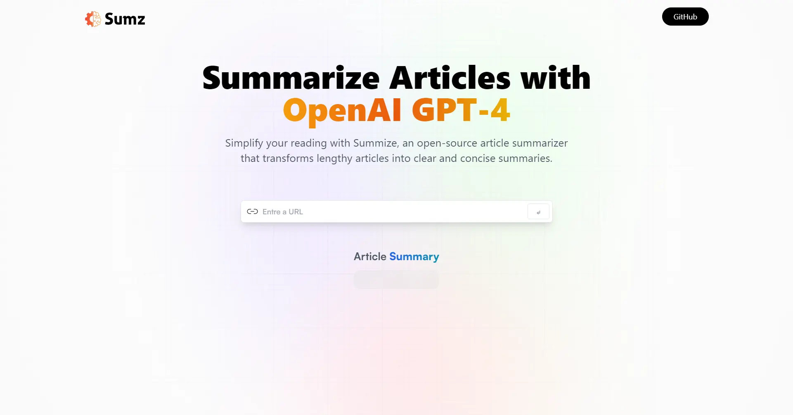

<div align="center">
    <a href="https://summarize-fv.netlify.app" target="_blank">
      
    </a>
  <h3 align="center">AI Summarizer</h3>
</div>

##  <br /> 📋 <a name="table">Table of Contents</a>

- ✨ [Introduction](#introduction)
- ⚙️ [Tech Stack](#tech-stack)
- 📝 [Features](#features)
- 🚀 [Quick Start](#quick-start)

##  <br /> <a name="introduction">✨ Introduction</a>

**[EN]** Summarize any article with one click using the powerful OpenAI model. This web app features a modern interface, allowing users to input article URLs for concise AI-generated summaries. It saves summaries locally for easy history management and offers copy-to-clipboard functionality for effortless sharing. Advanced RTK Query API requests optimize data fetching and management.

**[FR]** Résumez n'importe quel article en un clic grâce au puissant modèle OpenAI. Cette application web offre une interface moderne et conviviale, permettant aux utilisateurs d'entrer des URL d'articles pour obtenir des résumés concis générés par l'IA. Les résumés sont enregistrés localement pour une gestion facile de l'historique, et une fonction de copie dans le presse-papiers facilite le partage. Les requêtes API avancées de RTK Query optimisent la récupération et la gestion des données.

##  <br /> <a name="tech-stack">⚙️ Tech Stack</a>

- **React** is a popular JavaScript library for building user interfaces, particularly single-page applications where data changes over time. React's component-based architecture allows developers to create reusable UI components, making development more efficient and the codebase easier to maintain. Its virtual DOM enhances performance by minimizing direct interactions with the browser's DOM.

- **TypeScript** is a statically typed superset of JavaScript that allows for early detection of errors and more robust, maintainable code. TypeScript's type system helps developers catch mistakes early during the development process, ensuring a more stable and reliable application.

- **Redux Toolkit** is a toolset for efficient state management in React applications, providing simplified APIs and reducing boilerplate code. It enhances code maintainability and scalability by promoting best practices for managing application state.

- **OpenAI API** is a powerful interface for accessing OpenAI's language models and capabilities, enabling developers to integrate advanced natural language processing (NLP) functionalities into their applications. It provides tools for generating text, answering questions, and performing other AI-driven tasks efficiently and effectively.

- **Tailwind** is a utility-first CSS framework that speeds up UI development by providing a set of pre-built utility classes. It allows developers to quickly build custom designs without writing traditional CSS, promoting rapid prototyping and design consistency.


## <br/> <a name="features">📝 Features</a>

👉 **Modern User Interface**: A modern and user-friendly interface, offering an intuitive experience for users.

👉 **Summary Generation**: Users can input the URL of a lengthy article, and the web app utilizes AI to provide a concise summary of the article content.

👉 **History Saving with Local Storage**: The app includes a history feature, allowing users to save summaries locally, providing a convenient way to revisit and manage their reading history.

👉 **Copy to Clipboard Functionality**: Enables users to easily share or store the summarized content by copying it to their clipboard.

👉 **Advanced RTK Query API Requests**: Utilizes the advanced capabilities of Redux Toolkit (RTK) Query for making API requests. These requests fire conditionally based on specific criteria, optimizing data fetching and management.


## <br /> <a name="quick-start">🚀 Quick Start</a>

Follow these steps to set up the project locally on your machine.

<br/>**Prerequisites**

Make sure you have the following installed on your machine:

- [Git](https://git-scm.com/)
- [Node.js](https://nodejs.org/en)
- [npm](https://www.npmjs.com/) (Node Package Manager)

<br/>**Cloning the Repository**

```bash
git clone {git remote URL}
```

<br/>**Installation**

Let's install the project dependencies, from your terminal, run:

```bash
npm install
# or
yarn install
```

<br/>**Set Up Environment Variables**

Create a new file named `.env` in the root of your project and add the following content:

```env
VITE_RAPID_API_ARTICLE_KEY=
```

Replace the placeholder values with your actual respective account credentials:

- [Rapid API](https://rapidapi.com/)


<br/>**Running the Project**

Installation will take a minute or two, but once that's done, you should be able to run the following command:

```bash
npm run dev
# or
yarn dev
```

Open [`http://localhost:5173`](http://localhost:5173) in your browser to view the project.